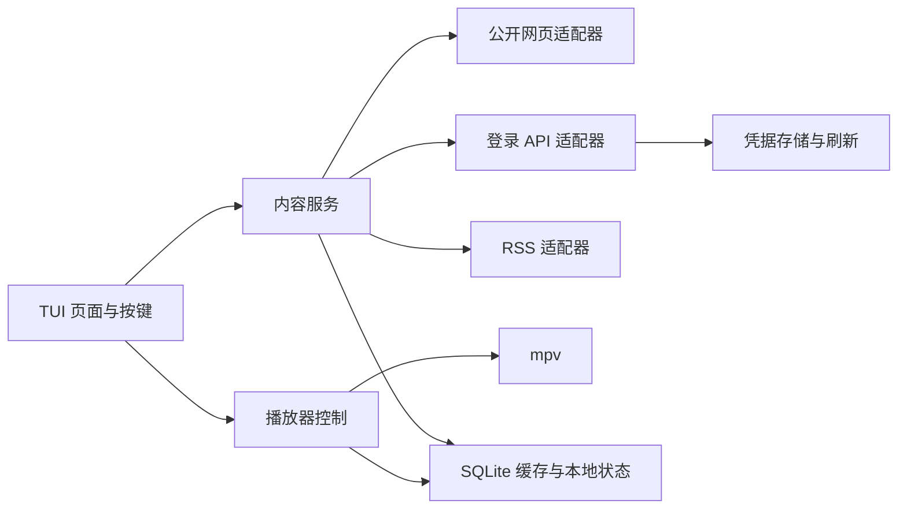

# 小宇宙 API 调研：供 TUI 客户端设计使用

调研日期：2026-09-14。本文的「源码确认」指已阅读固定提交中的请求构造和响应解析，**不等于接口已经在线调用成功**。本次已进行公开网页和音频分段读取实测；没有发送短信、扫码登录、读取账号数据或调用写入接口。字段级观测记录见 [xiaoyuzhou-public-probe.json](./xiaoyuzhou-public-probe.json)。

## 1. 结论与证据范围

开源客户端已经覆盖 TUI 所需的搜索、订阅、单集列表、详情、音频地址、收听历史、播放进度和评论读取。主要内容 API 位于 `https://api.xiaoyuzhoufm.com`，登录还有 `podcaster-api.xiaoyuzhoufm.com` 与 `web-api.xiaoyuzhoufm.com` 两套来源。现有实现足以绘制协议地图，但存在登录路径、订阅流版本、分页和响应包裹层的差异，应自己维护一层小型 API 适配器。[主机定义](https://github.com/jerryqx/dsh-xiaoyuzhou/blob/ac6a2defc85d4379a38f6b0406b2d4d171cc3627/lib/xyzfm.js#L24-L40)、[Go 接口路由及功能覆盖](https://github.com/ultrazg/xyz/blob/22cfe7848a98b393a5f9f62c5e9a4eea2592eb1b/router/router.go#L13-L83)

**可以开发：免登录的公开内容 TUI 已有可验证的数据链路；账号订阅、搜索和云端进度已有源码参考，仍需带账号验证。** 本次检查[官网](https://www.xiaoyuzhoufm.com/)与定向搜索，未找到面向第三方客户端的公开开发者文档或标准 OAuth 接入说明；这不证明不存在合作伙伴接口。下文 App/网页账号接口均按未公开的内部接口处理，不能据此承诺长期兼容。

## 2. 公开网页：本次实际验证的最小链路

2026-09-14 使用默认 curl User-Agent、无 Cookie、无 access/refresh token 请求以下公开资源。原始响应只保存在临时目录；字段和 HTTP 结果保存在 [xiaoyuzhou-public-probe.json](./xiaoyuzhou-public-probe.json)，没有保存完整 Shownotes 或评论正文。

| 探测对象 | 结果 | 对 TUI 的意义 |
| --- | --- | --- |
| [知行小酒馆节目页](https://www.xiaoyuzhoufm.com/podcast/6013f9f58e2f7ee375cf4216) | HTTP 200；声明共 270 集，页面内嵌 15 集 | 可以展示节目与最近单集，不能把首屏当完整历史 |
| [一度停车节目页](https://www.xiaoyuzhoufm.com/podcast/6154145ff1ab4fd904a8e964) | HTTP 200；声明共 18 集，页面内嵌 15 集 | 第二个样本同样只返回部分列表 |
| [公开单集页](https://www.xiaoyuzhoufm.com/episode/6aa37bcd492687f6aad83995) | HTTP 200；有标题、时长、Shownotes、公开音频 URL；内嵌首批评论 21 条 | 可实现分享链接打开、详情阅读、公开音频解析；评论数不是完整评论列表 |
| 上述单集音频，`Range: bytes=0-1023` | HTTP 206；`audio/mp4`；读到 1,024 字节；总大小 106,348,142 字节 | 验证了音频地址和字节范围传输；尚未验证解码、实际发声或播放器 seek |
| App 主机的 `GET /v1/episode/get?eid=…` 和 `GET /v1/podcast/get?pid=…` | 无凭据请求均为 HTTP 401，响应为 HTML | App API 不能直接当匿名 JSON API 使用；应先检查 HTTP 状态和 Content-Type |

这只是两个节目、一个单集的样本，不是全站可用性或固定页大小保证。本机默认 curl UA 在这些请求中可用，因此不能直接采信“所有请求都必须模拟某个手机 UA”的笼统说法；带登录态的 App API 需要另外验证请求头组合。

### 字段位置

公开 HTML 含 `<script id="__NEXT_DATA__" type="application/json">`，解析脚本文本为 JSON 后读取：

| 路径 | 含义 |
| --- | --- |
| `props.pageProps.podcast` | 节目对象 |
| `props.pageProps.podcast.episodes` | 首批单集数组；这两个样本均为 15 项 |
| `props.pageProps.episode` | 单集对象 |
| `episode.eid` / `episode.pid` | 单集 ID / 节目 ID，适合作为小宇宙数据的本地键 |
| `episode.title` / `episode.duration` / `episode.pubDate` | 标题、以秒计的时长、带 UTC 时区的发布时间 |
| `episode.shownotes` | HTML 正文；TUI 需转换为文本并保留链接、时间戳 |
| `episode.media.source.url` | 当前媒体 URL；以返回的完整 URL 为准 |
| `episode.enclosure.url` | 另一媒体字段；本次单集样本与上项相同，不能假定所有单集一致 |
| `episode.media.mimeType` / `episode.media.source.mode` / `episode.isPrivateMedia` | 媒体类型及公开/私有相关标记 |
| `props.pageProps.comments` | 页面嵌入的首批评论 |

样本中有 `transcript`，但其内容只有 `mediaId`，没有逐字稿正文。看到这个字段不能推断免登录就能取到字幕。RSS 同步节目的 `media.id` 还可能与实际播放 URL 路径不同，应直接读取 `media.source.url`，不要自行拼接 CDN 地址。

### 可复现的只读例子

下面是本次已使用的页面提取方式，适合验证字段；正式客户端建议使用 HTML 解析器定位脚本，并处理页面错误、字段缺失和结构变化。

```bash
curl --compressed --fail --silent --show-error --max-time 20 \
  'https://www.xiaoyuzhoufm.com/episode/6aa37bcd492687f6aad83995' \
  -o /tmp/xiaoyuzhou-episode.html

python3 - <<'PY'
import json, re
from pathlib import Path

html = Path('/tmp/xiaoyuzhou-episode.html').read_text()
match = re.search(r'<script id="__NEXT_DATA__"[^>]*>(.*?)</script>', html, re.S)
if not match:
    raise SystemExit('没有找到页面数据，请检查页面或访问状态')
episode = json.loads(match.group(1))['props']['pageProps']['episode']
print(json.dumps({
    'eid': episode['eid'],
    'title': episode['title'],
    'duration_seconds': episode['duration'],
    'audio_url': episode.get('media', {}).get('source', {}).get('url'),
}, ensure_ascii=False, indent=2))
PY
```


## 3. 参考项目、更新时间与许可

日期为本次通过 GitHub API 获取的默认分支最新提交时间（UTC）；文档提交不能当作 API 最近验证日期。五个固定快照中的 `LICENSE` 均为 MIT，复用时仍应保留对应版权和许可文本。

| 项目 | 固定提交 / 最新提交日期 | 实际参考价值 | 许可 |
|---|---|---|---|
| ultrazg/xyz | [`22cfe784`](https://github.com/ultrazg/xyz/commit/22cfe7848a98b393a5f9f62c5e9a4eea2592eb1b)，2026-08-13 | Go HTTP 包装服务，接口面最广；最新提交仅添加第三方登录风险提示，短信实现最近修改为 2026-05-24，订阅更新流文件为 2025-04-17 | [MIT](https://github.com/ultrazg/xyz/blob/22cfe7848a98b393a5f9f62c5e9a4eea2592eb1b/LICENSE) |
| jerryqx/dsh-xiaoyuzhou | [`ac6a2def`](https://github.com/jerryqx/dsh-xiaoyuzhou/commit/ac6a2defc85d4379a38f6b0406b2d4d171cc3627)，2026-08-27 | JavaScript 实现；扫码登录、历史与进度有参考价值；API 文件最近修改为 2026-08-26 | [MIT](https://github.com/jerryqx/dsh-xiaoyuzhou/blob/ac6a2defc85d4379a38f6b0406b2d4d171cc3627/LICENSE) |
| r266-tech/xiaoyuzhou | [`24cc9331`](https://github.com/r266-tech/xiaoyuzhou/commit/24cc933197080082e9e7828beb3fd4583191e363)，2026-06-10 | Python CLI；字幕、单集游标分页、日期过滤、凭据原子写入可借鉴；部分其他列表只取一页 | [MIT](https://github.com/r266-tech/xiaoyuzhou/blob/24cc933197080082e9e7828beb3fd4583191e363/LICENSE) |
| sorosliu1029/cosmos-wormhole | [`a40fff0e`](https://github.com/sorosliu1029/cosmos-wormhole/commit/a40fff0e2854d04cb4ab3f1e65bb1be32e2ec2c1)，2025-07-22 | Python 异步 SDK；主播平台扫码登录、通用分页、评论/回复及 `/v2/inbox/list` | [MIT](https://github.com/sorosliu1029/cosmos-wormhole/blob/a40fff0e2854d04cb4ab3f1e65bb1be32e2ec2c1/LICENSE) |
| MosesHe/xiaoyuzhoufm-mcp | [`b0c7098e`](https://github.com/MosesHe/xiaoyuzhoufm-mcp/commit/b0c7098e39485b38c731628b67bc8e89458dd61e)，2025-05-20 | 较早的 Go 实现，可交叉核对短信登录、刷新 token、搜索和节目接口；不宜当最新登录依据 | [MIT](https://github.com/MosesHe/xiaoyuzhoufm-mcp/blob/b0c7098e39485b38c731628b67bc8e89458dd61e/LICENSE) |

相关文件提交证据：[xyz 短信修复](https://github.com/ultrazg/xyz/commit/87b34980adc8182bee30c87727663cf5d5efaa80)、[xyz 订阅流修复](https://github.com/ultrazg/xyz/commit/bc16d762f13b304a3a63ee0945f63172e5059fdc)、[JS 历史与进度实现](https://github.com/jerryqx/dsh-xiaoyuzhou/commit/27ed6b1609ab5ae26e6325a9ca1d7e032de84e60)、[Python 日期与字幕修复](https://github.com/r266-tech/xiaoyuzhou/commit/dca94e400a5e241df2d8bc74a4cc1a429c594806)。这些提交中的作者实测陈述仍是作者报告，本次没有复现。

## 4. 登录：至少三套现成实现，不能混用路径

### 4.1 扫码登录候选

| 来源 | 主机 | 方法与路径 | JSON body / 关键请求头 |
|---|---|---|---|
| JS 网页账号体系 | `https://web-api.xiaoyuzhoufm.com` | `POST /v1/auth/qrcode/create` | `{"clientId":"xyz-web"}`；`x-midway-app-id: v6worU4NnWyL`，Origin/Referer 指向 `https://accounts.xiaoyuzhoufm.com` |
| JS 网页账号体系 | 同上 | `POST /v1/auth/qrcode/login` | `{"id":"<create 返回的 id>"}`；同一组请求头 |
| Python 主播平台体系 | `https://podcaster-api.xiaoyuzhoufm.com` | `POST /v1/auth/qrcode/create` | `{"clientId":"podcaster-platform"}`；创建时同样传 `X-Midway-App-Id: v6worU4NnWyL` |
| Python 主播平台体系 | 同上 | `POST /v1/auth/qrcode/login` | `{"id":"<create 返回的 id>"}` |

JS 解析创建响应的顶层 `id`、`url`；轮询状态兼容 `WAITTING`（源码拼写）、`SCANNED`、`USED`、`CONFIRMED`、`EXPIRED`。成功的当次响应从头部读取 `x-jike-access-token` 和 `x-jike-refresh-token`，不能只保存 JSON。JS 将 400/401 归类为二维码失效；Python 只将 `USED` 视为成功，每秒轮询，提示用户在小宇宙 App 扫描并确认登录主播后台。这些是客户端当前的状态处理方式，不是官方协议保证。[JS 完整扫码流程](https://github.com/jerryqx/dsh-xiaoyuzhou/blob/ac6a2defc85d4379a38f6b0406b2d4d171cc3627/lib/xyzfm.js#L409-L473)、[Python 扫码流程](https://github.com/sorosliu1029/cosmos-wormhole/blob/a40fff0e2854d04cb4ab3f1e65bb1be32e2ec2c1/src/cosmos_wormhole/endpoints/login.py#L9-L57)

**设计判断：**扫码很适合终端显示二维码，但仍需用户本人确认。先验证它能否签发当前内容 API 接受的凭据，再决定成为默认登录方式；当前资料不足以保证它对所有账号有效。

### 4.2 短信登录路径分歧

| 来源 | 发短信 | 验证登录 | 请求参数 |
|---|---|---|---|
| xyz 当前快照、r266 Python | `POST https://podcaster-api.xiaoyuzhoufm.com/v1/auth/send-code` | `POST https://podcaster-api.xiaoyuzhoufm.com/v1/auth/login-with-sms` | 发码 `mobilePhoneNumber`、`areaCode`；登录另加 `verifyCode` |
| JS、MosesHe 较早 Go | `POST https://api.xiaoyuzhoufm.com/v1/auth/sendCode` | `POST https://api.xiaoyuzhoufm.com/v1/auth/loginOrSignUpWithSMS` | 相同字段；常用 `areaCode: "+86"` |

登录凭据在**响应头**，用户对象通常按 `data.user` 读取，JS 还兼容其他包裹层。[xyz 发码](https://github.com/ultrazg/xyz/blob/22cfe7848a98b393a5f9f62c5e9a4eea2592eb1b/handlers/sendcode.go#L37-L51)、[xyz 登录及响应转换](https://github.com/ultrazg/xyz/blob/22cfe7848a98b393a5f9f62c5e9a4eea2592eb1b/handlers/login.go#L83-L143)、[Python 短信实现](https://github.com/r266-tech/xiaoyuzhou/blob/24cc933197080082e9e7828beb3fd4583191e363/xiaoyuzhou/client.py#L187-L239)、[JS 短信实现](https://github.com/jerryqx/dsh-xiaoyuzhou/blob/ac6a2defc85d4379a38f6b0406b2d4d171cc3627/lib/xyzfm.js#L336-L406)、[MosesHe 短信实现](https://github.com/MosesHe/xiaoyuzhoufm-mcp/blob/b0c7098e39485b38c731628b67bc8e89458dd61e/internal/xyzclient/auth_api.go#L14-L155)

JS 作者说明短信端点受滑块验证影响，并对响应文字含 captcha、提示升级、`code === 1003` 等情况报告 `captcha_blocked`。这证明项目有相应错误处理，**不能证明目前所有短信登录都失败，也不能证明从官方 App 收到的验证码一定可被第三方客户端复用**。本次未发送验证码，不能判断具体账号、地区、设备下的成功率。[JS 错误分支与作者说明](https://github.com/jerryqx/dsh-xiaoyuzhou/blob/ac6a2defc85d4379a38f6b0406b2d4d171cc3627/lib/xyzfm.js#L336-L384)

### 4.3 Token 与请求头

- 内容请求使用 `x-jike-access-token`，不是标准 Bearer 示例。刷新使用 `POST https://api.xiaoyuzhoufm.com/app_auth_tokens.refresh`，将旧 refresh token 放在 `x-jike-refresh-token` 请求头；多个实现发送空 body。[Python 刷新实现](https://github.com/r266-tech/xiaoyuzhou/blob/24cc933197080082e9e7828beb3fd4583191e363/xiaoyuzhou/client.py#L241-L269)
- 刷新响应存在解析分歧：cosmos-wormhole 只读响应头，MosesHe 读取 JSON 顶层 token 字段，JS 读取顶层或 `data` 内 token；r266 同时读响应头和顶层 JSON。建议适配器兼容这几种形状并校验 token 非空。固定有效期没有可靠官方证据；cosmos 代码中的 30 天是本地写死的过期策略。[cosmos token](https://github.com/sorosliu1029/cosmos-wormhole/blob/a40fff0e2854d04cb4ab3f1e65bb1be32e2ec2c1/src/cosmos_wormhole/managers/token.py#L38-L58)、[MosesHe 刷新](https://github.com/MosesHe/xiaoyuzhoufm-mcp/blob/b0c7098e39485b38c731628b67bc8e89458dd61e/internal/xyzclient/auth_api.go#L158-L219)、[JS 刷新](https://github.com/jerryqx/dsh-xiaoyuzhou/blob/ac6a2defc85d4379a38f6b0406b2d4d171cc3627/lib/xyzfm.js#L320-L333)
- 现有代码发送 App 版本、平台、设备标识、时区、语言等头，但它们的最小必需集合尚未验证。Go/JS 使用 iOS `Xiaoyuzhou/2.57.1`，r266 使用 Android `Xiaoyuzhou/2.99.1(android 28)`；不能把这些常量当成最新 App 版本。设备 ID 应在本机生成并持久化，避免复制示例仓库的共享固定值。[iOS 头](https://github.com/jerryqx/dsh-xiaoyuzhou/blob/ac6a2defc85d4379a38f6b0406b2d4d171cc3627/lib/xyzfm.js#L279-L294)、[Android 头](https://github.com/r266-tech/xiaoyuzhou/blob/24cc933197080082e9e7828beb3fd4583191e363/xiaoyuzhou/client.py#L53-L80)

**实现建议：**401 后串行刷新一次再重试；429/网络中断/5xx 应保留凭据，不能把所有 4xx 直接当作凭据永久失效。r266 的「所有刷新 4xx 都清空 token」恰是需要修改的策略。凭据可参考它的锁、临时文件与原子替换，但并发刷新本身还需要单独串行化。[现有错误策略](https://github.com/r266-tech/xiaoyuzhou/blob/24cc933197080082e9e7828beb3fd4583191e363/xiaoyuzhou/client.py#L241-L307)、[凭据写入实现](https://github.com/r266-tech/xiaoyuzhou/blob/24cc933197080082e9e7828beb3fd4583191e363/xiaoyuzhou/client.py#L115-L155)

## 5. TUI 需要的核心接口

除特别注明，主机均为 `https://api.xiaoyuzhoufm.com`，POST 参数为 JSON。下表全部为**源码确认、账号态在线未验证**。参数是现有客户端实际发送的形状，不代表官方完整字段约束。

| 功能 | 方法与路径 | 请求参数及分页 | 固定源码 |
|---|---|---|---|
| 当前用户 | `GET /v1/profile/get` | 无业务参数 | [profile.go](https://github.com/ultrazg/xyz/blob/22cfe7848a98b393a5f9f62c5e9a4eea2592eb1b/handlers/profile.go#L12-L42) |
| 账号播放列表 | `POST /v1/playlist/pull` | 首次 `{}`；`data.list` 是按队列顺序排列的单集 ID，需要另取单集详情；见文末补充实测 | [playlist.py](https://github.com/sorosliu1029/cosmos-wormhole/blob/a40fff0e2854d04cb4ab3f1e65bb1be32e2ec2c1/src/cosmos_wormhole/endpoints/playlist.py) |
| 搜节目/单集/用户 | `POST /v1/search/create` | `keyword`，`type: PODCAST / EPISODE / USER`；Go 还传 `limit:"20"`、页面来源；可带 `pid`；Go 游标为 `{loadMoreKey:<数字>,searchId:<字符串>}` | [Go 搜索](https://github.com/ultrazg/xyz/blob/22cfe7848a98b393a5f9f62c5e9a4eea2592eb1b/handlers/search.go#L13-L91)、[Python 类型](https://github.com/sorosliu1029/cosmos-wormhole/blob/a40fff0e2854d04cb4ab3f1e65bb1be32e2ec2c1/src/cosmos_wormhole/endpoints/search.py#L7-L34) |
| 我的订阅 | `POST /v1/subscription/list` | `sortBy:"subscribedAt"`、`sortOrder:"desc"`、`limit`；可带 `uid`；Go 游标 `{skip:<数字>}` | [subscription.go](https://github.com/ultrazg/xyz/blob/22cfe7848a98b393a5f9f62c5e9a4eea2592eb1b/handlers/subscription.go#L13-L78) |
| 订阅更新流 | `POST /v1/inbox/list`；另一实现为 `POST /v2/inbox/list` | `limit`；v1 游标 `{pubDate,id}`；v2 原样回传服务器 `loadMoreKey` | [Go v1](https://github.com/ultrazg/xyz/blob/22cfe7848a98b393a5f9f62c5e9a4eea2592eb1b/handlers/inbox.go#L13-L76)、[Python v2](https://github.com/sorosliu1029/cosmos-wormhole/blob/a40fff0e2854d04cb4ab3f1e65bb1be32e2ec2c1/src/cosmos_wormhole/endpoints/inbox.py#L5-L8) |
| 节目详情 | `GET /v1/podcast/get` | Query `pid` | [podcast.go](https://github.com/ultrazg/xyz/blob/22cfe7848a98b393a5f9f62c5e9a4eea2592eb1b/handlers/podcast.go#L13-L63) |
| 节目内单集 | `POST /v1/episode/list` | `pid`，`order:"desc" / "asc"`；Go 游标 `{pubDate,id,direction}`；部分实现另传 `limit` | [episode.go](https://github.com/ultrazg/xyz/blob/22cfe7848a98b393a5f9f62c5e9a4eea2592eb1b/handlers/episode.go#L13-L86) |
| 单集详情与 shownotes | `GET /v1/episode/get` | Query `eid`；应从详情读取音频和节目对象 | [GET 方法](https://github.com/r266-tech/xiaoyuzhou/blob/24cc933197080082e9e7828beb3fd4583191e363/xiaoyuzhou/client.py#L386-L388) |
| 音频地址 | 通常随单集详情返回 | Python 优先取 `media.source.url`，回退 `enclosure.url`；保存单集 ID，播放时解析 URL | [字段归一化](https://github.com/r266-tech/xiaoyuzhou/blob/24cc933197080082e9e7828beb3fd4583191e363/xiaoyuzhou/client.py#L569-L592) |
| 私有/付费音频地址 | `GET /v1/private-media/get` | Query `eid`、`dubbing=false`；JS 取 `data.url`；现有说明要求账号已购买，不意味着能免费播放 | [privateMediaGet](https://github.com/jerryqx/dsh-xiaoyuzhou/blob/ac6a2defc85d4379a38f6b0406b2d4d171cc3627/lib/xyzfm.js#L557-L564) |
| 收听历史 | `POST /v1/episode-played/list-history` | 首次 `{}`，以后传 `loadMoreKey`；Go 用字符串游标，JS 作者记录为 ISO 时间戳；历史项包含 `episode` | [Go 历史](https://github.com/ultrazg/xyz/blob/22cfe7848a98b393a5f9f62c5e9a4eea2592eb1b/handlers/history.go#L13-L63)、[JS 解析](https://github.com/jerryqx/dsh-xiaoyuzhou/blob/ac6a2defc85d4379a38f6b0406b2d4d171cc3627/lib/xyzfm.js#L584-L606) |
| 批量读播放进度 | `POST /v1/playback-progress/list` | `{"eids":["<eid>"]}`；JS 解析每项 `eid`、`progress`、`playedAt`，将 progress 视为秒 | [Go 参数](https://github.com/ultrazg/xyz/blob/22cfe7848a98b393a5f9f62c5e9a4eea2592eb1b/handlers/episode.go#L168-L221)、[JS 解析](https://github.com/jerryqx/dsh-xiaoyuzhou/blob/ac6a2defc85d4379a38f6b0406b2d4d171cc3627/lib/xyzfm.js#L609-L626) |
| 更新播放进度（写入） | `POST /v1/playback-progress/update` | `{"data":[{"pid":"…","eid":"…","progress":120,"playedAt":"<时间字符串>"}]}`；Go 要求 progress 非负，具体时间语义/冲突规则仍待验证 | [更新进度](https://github.com/ultrazg/xyz/blob/22cfe7848a98b393a5f9f62c5e9a4eea2592eb1b/handlers/episode.go#L237-L303) |
| 单集主评论 | `POST /v1/comment/list-primary` | `owner:{id:<eid>,type:"EPISODE"}`，`order: HOT / TIMESTAMP / TIME`；Go 游标 `{id,direction,hotSortScore,section}` | [Go 参数](https://github.com/ultrazg/xyz/blob/22cfe7848a98b393a5f9f62c5e9a4eea2592eb1b/handlers/comment.go#L13-L75)、[Python 排序类型](https://github.com/sorosliu1029/cosmos-wormhole/blob/a40fff0e2854d04cb4ab3f1e65bb1be32e2ec2c1/src/cosmos_wormhole/endpoints/comment.py#L7-L18) |
| 评论回复 | `POST /v1/comment/list-thread` | `primaryCommentId`，`order: SMART / TIME`；Python 通用分页传 `loadMoreKey`，Go 包装未暴露回复分页字段 | [Python 回复](https://github.com/sorosliu1029/cosmos-wormhole/blob/a40fff0e2854d04cb4ab3f1e65bb1be32e2ec2c1/src/cosmos_wormhole/endpoints/comment.py#L21-L30)、[通用分页](https://github.com/sorosliu1029/cosmos-wormhole/blob/a40fff0e2854d04cb4ab3f1e65bb1be32e2ec2c1/src/cosmos_wormhole/endpoints/base.py#L18-L49) |
| 单集文稿/字幕 | `POST /v1/episode-transcript/get` | `eid`、`mediaId`；Python 读取 `data.transcriptUrl`，兼容双层 `data` | [字幕接口](https://github.com/r266-tech/xiaoyuzhou/blob/24cc933197080082e9e7828beb3fd4583191e363/xiaoyuzhou/client.py#L390-L401) |

`/v1/inbox/list` 与 `/v2/inbox/list` 都有源码依据，当前哪版可用、两版返回语义是否相同，本次没有凭据验证。不要把「订阅列表」和「订阅的更新流」混成一个接口。

附带写接口也有实现：订阅切换 `POST /v1/subscription/update`，body `{pid,mode:"ON"/"OFF"}`；评论创建 `POST /v1/comment/create`，body `{text,owner:{id,type},replyToCommentId?}`；删除评论 `POST /v1/comment/remove`，body `{commentId}`。对第一版 TUI，可以先实现读取，后续再单独设计这些写入动作。[订阅更新](https://github.com/ultrazg/xyz/blob/22cfe7848a98b393a5f9f62c5e9a4eea2592eb1b/handlers/subscription.go#L266-L323)、[创建/删除评论](https://github.com/ultrazg/xyz/blob/22cfe7848a98b393a5f9f62c5e9a4eea2592eb1b/handlers/comment.go#L441-L571)

## 6. 不能直接照抄的细节

1. **区分本地包装服务与上游协议。** xyz 对本地暴露 `/episode_detail` 等路由，上游真实请求是 `GET /v1/episode/get?eid=…`；它也把上游登录响应头 token 重新装入自己返回的 JSON。直接连接小宇宙时不能按包装服务的路由和 JSON 层级实现。[本地路由](https://github.com/ultrazg/xyz/blob/22cfe7848a98b393a5f9f62c5e9a4eea2592eb1b/router/router.go#L13-L40)、[登录重包装](https://github.com/ultrazg/xyz/blob/22cfe7848a98b393a5f9f62c5e9a4eea2592eb1b/handlers/login.go#L136-L143)
2. **把游标当不透明 JSON 原样保存。** 各接口的 `loadMoreKey` 有对象、数字字段和字符串等形态，不是统一页码。列表解析应保留顶层游标；JS 的 `pickPage` 支持两层结构，但若调用者先传 `data.data`，顶层游标仍会丢失——其历史方法已改成传完整响应，搜索/单集/订阅方法还保留旧调用方式。这个判断来自代码路径分析，尚未运行复现。[分页函数与调用点](https://github.com/jerryqx/dsh-xiaoyuzhou/blob/ac6a2defc85d4379a38f6b0406b2d4d171cc3627/lib/xyzfm.js#L499-L606)
3. **不要把本地 limit 当成服务器保证。** r266 单集代码会追踪游标，但订阅列表仅请求 `limit:"200"` 一页，搜索和历史也是单次请求后本地切片。完整客户端需要分别处理每个列表的游标，并加重复游标、空页与取消操作保护；约 15/20 条页大小是项目记录，不是稳定契约。[Python 列表实现](https://github.com/r266-tech/xiaoyuzhou/blob/24cc933197080082e9e7828beb3fd4583191e363/xiaoyuzhou/client.py#L314-L384)、[搜索/历史单页实现](https://github.com/r266-tech/xiaoyuzhou/blob/24cc933197080082e9e7828beb3fd4583191e363/xiaoyuzhou/client.py#L512-L536)
4. **历史与续播进度应分别取。** 历史中的 `isPlayed` / `isFinished` 不能替代精确秒数。批量进度接口已有实现，TUI 可以按历史页内的 eid 集合查询；是否需要另外上报历史、完成状态与收听统计仍需明确验证。[历史和进度分别读取](https://github.com/jerryqx/dsh-xiaoyuzhou/blob/ac6a2defc85d4379a38f6b0406b2d4d171cc3627/lib/xyzfm.js#L584-L626)
5. **字幕 ID 不一定等于音频 URL。** r266 的修复优先取 `transcriptMediaId`，其次 `transcript.mediaId`，最后 `media.id`，为 RSS 转入节目兼容原生字幕标识；字幕 CDN 的 User-Agent 要求是作者观察，仍需重新验证。[字幕 ID 选择](https://github.com/r266-tech/xiaoyuzhou/blob/24cc933197080082e9e7828beb3fd4583191e363/xiaoyuzhou/client.py#L569-L591)
6. **日期筛选先转显示时区。** 发布时间是带时区的 ISO 时间，按北京时间的自然日筛选时，不能直接截取 UTC 日期。r266 已有相关修复；这是客户端数据处理问题，与 endpoint 本身分开实现。[日期转换](https://github.com/r266-tech/xiaoyuzhou/blob/24cc933197080082e9e7828beb3fd4583191e363/xiaoyuzhou/client.py#L30-L45)

## 7. RSS 可以补充什么

RSS 适合作为独立的内容来源，支持用户粘贴主播公开的订阅地址。例如[边角聊官方收听指南](https://leftovertalk.fm/subscribe)同时提供小宇宙入口和 RSS，供泛用播客客户端使用。它能帮助 TUI 获取该 Feed 发布的内容，但不提供小宇宙账号的订阅关系、社区评论或云端播放进度，也不能承诺包含平台上的全部单集。

本次两个节目对象的 `syncMode` 分别为 `SELF_HOSTING` 和 `RSS`，均未暴露名称含 `rss` 或 `feed` 的顶层字段。因此不要把“知道 pid 就能计算 RSS 地址”作为产品前提。优先支持用户提供的 Feed 或主播官网公布的地址，并将 RSS GUID 与小宇宙 eid 分开存储；跨来源匹配需要额外规则。

## 8. 对这个 TUI 项目的实施建议

以下是基于调研的设计建议，不是小宇宙官方接口约定。

### 开发顺序

1. **先做公开播放闭环**：粘贴节目/单集链接 → 元数据与 Shownotes → 播放/暂停/快进/倍速 → 本地收藏、播放队列、进度保存。节目页明确标注“最近单集”，避免误导用户以为历史已完整加载。
2. **单独验证登录闭环**：扫码 → 本机保存凭据 → 拉取自己的订阅 → 翻到第二页 → 获取免费单集 → 过期后刷新。这些成功后，再承诺账号搜索、完整列表和订阅同步。TUI 二维码可用终端块字符展示，并提供打开登录页的入口。
3. **再扩展账号写操作**：订阅/取消订阅、收藏和云端进度。进度同步的秒数、完成状态、冲突规则需要实测，默认先保留可靠的本地续播。

### 模块边界



对外按实际支持情况暴露 `search`、`listEpisodes`、`listSubscriptions`、`resolveAudio` 等能力。分页结果携带不透明 cursor，并区分“有下一页”“已全部获取”“来源只提供部分列表”；公开网页没有 cursor 不能自动解释为历史已读完。

没有既定语言偏好时，可以选 **Rust + Ratatui + mpv + SQLite**；若团队更熟悉 Go，则用 **Go + Bubble Tea + mpv + SQLite**。这两个框架均为终端 UI 项目，语言选择不影响上游接口的可行性。[Ratatui 官方站点](https://ratatui.rs/)、[Bubble Tea 源码](https://github.com/charmbracelet/bubbletea)。

首版建议通过 **mpv JSON IPC** 控制 `loadfile`、`pause`、`seek`、`speed`，订阅播放时间事件；mpv 文档明确支持外部程序通过本地 socket 控制并接收事件。这样可以复用流媒体播放和解码能力。需要进一步嵌入时再评估 libmpv。IPC socket 放在当前用户的私有运行目录；请求和事件使用 JSON，避免解析播放器的终端输出。[mpv 官方嵌入说明](https://mpv.io/manual/stable/#embedding-into-other-programs)、[JSON IPC](https://mpv.io/manual/stable/#json-ipc)。首次调研时本机未安装 mpv；后续实现与播放器验证见第 13 节。

### 接入时需要处理的具体问题

- **媒体地址重新解析**：保存 eid 与播放秒数；播放失败时重新获取单集媒体信息，不把一次返回的 URL 当永久地址。公开音频和需授权媒体分开处理。
- **刷新串行化**：多个页面同时遇到 401 时只运行一次刷新；原子保存最新 token 对。网络超时不等于凭据失效。
- **凭据隔离**：macOS 可用 Keychain；跨平台配置文件至少限制为当前用户可读，日志不记录 token。认证请求头只发给对应 API 主机，不随音频 CDN 或外部链接转发。
- **错误和分页**：保留 HTTP 状态与业务错误；`loadMoreKey` 按原始 JSON 回传，检测重复 cursor，列表按 eid/pid 去重。429 遵循服务端等待提示，GET 失败使用有限退避；不要每次 TUI 重绘都发请求。
- **正文展示**：将 HTML 转为文本，保留链接和可跳转时间戳；过滤终端控制字符，按显示宽度处理中文折行。
- **验证范围**：带账号的短信/扫码、token 刷新、搜索、完整订阅分页、云端进度、已购内容播放均未在本次实测。已验证的是公开页面取数和一个音频 URL 的 Range 传输。

## 9. 下一步需要补证的项目

- 扩大公开网页样本：下架单集、不同托管来源、试播内容、无字幕内容；检查字段缺失与页面结构变化。RSS 是否补足历史取决于各 Feed 的内容。
- 默认扫码流程在当前账号上的完整成功链路：创建 → 扫描确认 → 当次捕获 token → `profile/get` → 订阅列表；本次没有执行。
- `inbox` 的 v1/v2、每个列表的响应包裹层、游标终止条件，以及 token 轮转后的并发行为。
- 音频 URL 的有效期、实际播放器解码/seek/断线续播和外部托管节目差异；本次一个公开音频的 HTTP Range 已通过。
- 同一账号多端播放的进度冲突策略；第一版可先本地保存进度，云端同步作为独立可选能力。

上面是实现验证清单，不意味着这些功能目前已验证可用。扫码登录取得的 token 被开源代码用于 App API 主机，是现有实现行为；本次未做跨主机登录验证，不能称为官方支持的授权流程。下一轮有账号授权的测试应使用真实响应做脱敏 fixture，优先覆盖分页、刷新、失效和付费权限返回这些最容易影响 TUI 体验的边界。

## 10. 2026-09-14 播放列表补充实测

本节补充前文的账号态验证范围。使用本客户端已保存的扫码登录 access token，读取 `POST https://api.xiaoyuzhoufm.com/v1/playlist/pull`，body 为 `{}`，返回 HTTP 200。该账号此次有 4 个单集 ID；`data` 包含 `kind`、`list`、`sha` 和 `lastModified`，最后一项包含 `time`、`deviceId`、`deviceName`。本次未保存原始账号响应，也未输出凭据。

对队列首项请求 `GET /v1/episode/get?eid=…` 返回 HTTP 200，确认 `data.eid`、`title`、`duration`（整数秒）以及 `podcast.title`。这些请求只携带 access token；`User-Agent: xyz-tui/0.1.0`，不需要发送 refresh token 或复制设备标识。播放列表端点的源码依据为 [cosmos-wormhole Playlist](https://github.com/sorosliu1029/cosmos-wormhole/blob/a40fff0e2854d04cb4ab3f1e65bb1be32e2ec2c1/src/cosmos_wormhole/endpoints/playlist.py)，分页依据为其 [ListBase](https://github.com/sorosliu1029/cosmos-wormhole/blob/a40fff0e2854d04cb4ab3f1e65bb1be32e2ec2c1/src/cosmos_wormhole/endpoints/base.py)。

本次真实响应没有 `loadMoreKey`。客户端兼容顶层不透明 JSON 游标，防止重复游标和带游标的空页导致循环，并按 ID 去重；分页分支通过模拟 HTTP 测试验证，尚无真实多页队列样本。单集详情最多同时请求 4 项，并保留原队列顺序。最初版本遇到 401 提供重新扫码入口；自动续期已在下节补充，该阶段尚未实现队列写入和音频播放；后续播放与移除实现见第 13 节。

## 11. 2026-09-14 登录恢复与自动续期修复

用户反馈再次启动要求扫码。复现时，原 `session.json` 仍然存在，access token 与 refresh token 均已保存，文件权限为 `0600`。使用原 access token 请求启动校验 `/web/user/get-me` 和播放列表 `/v1/playlist/pull` 都返回 401。旧版启动逻辑在校验失败后直接创建二维码，没有使用已保存的 refresh token，这是此次要求重复扫码的原因。

修复后，通过 `POST https://api.xiaoyuzhoufm.com/app_auth_tokens.refresh` 自动续期，请求只发送 refresh token，不发送 access token；成功返回的新凭据由主事件循环原子保存，再用于后续请求。兼容响应头、JSON 顶层和 `data` 中的 `x-jike-access-token` / `x-jike-refresh-token`，只有完整且可用作请求头的凭据对才会保存。请求协议参考 [r266 的刷新实现](https://github.com/r266-tech/xiaoyuzhou/blob/24cc933197080082e9e7828beb3fd4583191e363/xiaoyuzhou/client.py#L241-L269)。

本机原有登录已成功自动续期，随后播放列表正常显示 4 条单集；关闭应用并再次启动直接恢复主界面，全程没有重新扫码。此次没有记录凭据内容或完整刷新响应。启动续期、续期后再次启动、播放列表 401 后续期并仅重试一次、异常时保留凭据、过时响应不能覆盖登录状态，以及不同响应格式均有模拟接口回归测试。

续期接口返回 401 时允许重新扫码；429、5xx、网络错误及不完整响应保留原凭据，不能据此宣告账号已退出。新凭据保存失败时保留在内存中供重试保存，不重复消费续期请求。本次只验证当前账号的成功续期，未验证 refresh token 的固定有效期，也没有推断其具体时长。

## 12. 播放列表元数据补充验证

使用当前账号的 4 个队列单集 ID 请求 `POST /v1/playback-progress/list`，body 为 `{"eids":["…"]}`，返回 HTTP 200。`data` 是 4 项数组，每项包含 `eid`、`pid`、`progress`、`playedAt`；本次 `progress` 均为整数，客户端也兼容非负小数秒。通过 `eid` 关联详情，剩余秒数为总时长减去已播放秒数并向上取整，最小为零。请求按最多 50 个 ID 分批，这是本客户端的请求规模选择，不是经验证的服务器上限。缺失或无法读取的进度不会当成零。

再次读取 `/v1/playlist/pull`，仍只有单集 ID 列表和整个队列的 `lastModified`。没有逐条加入时间，`playedAt` 则是播放时间；二者都不作为加入日期。用户选择暂不显示日期，因此两行界面只展示标题、播客名和剩余时长。没有用发布时间或本地发现时间填充加入日期，也没有保存原始账号数据。


## 13. 2026-09-15 播放、全局控制和云端移除

本次实现采用 Rust 后台任务管理 mpv 0.41.0，通过用户私有临时目录中的 Unix socket 订阅 `time-pos`、`pause`、`duration` 与 `end-file`。媒体 URL 仅传给播放器，不传账号认证头。播放器生命周期独立于页面，Space 为全局按键；换集会终止前一个播放器，退出清理子进程。实现依据 [mpv JSON IPC 文档](https://mpv.io/manual/stable/#json-ipc)。

播放前重新获取 `/v1/episode/get` 与 `/v1/playback-progress/list`，从 `media.source.url` 或 `enclosure.url` 解析音频。对 `isPrivateMedia` 使用 `/v1/private-media/get?eid=…&dubbing=false`；这一分支通过模拟接口测试，未用真实付费单集验证。只接受无内嵌凭据的 HTTP/HTTPS URL；服务器记录已播完时从头播放。

进度上传为 `POST /v1/playback-progress/update`：

```json
{"data":[{"pid":"podcast-id","eid":"episode-id","progress":123,"playedAt":"2026-09-15T00:00:00Z"}]}
```

必须携带 `x-jike-access-token` 和 **`local-time`（当前 RFC 3339 时间）**。缺少后者实测返回 HTTP 400、`Missing client time`；补齐后 HTTP 200、body `{}`，随后 `/v1/playback-progress/list` 读回的整数秒数与上传一致。协议字段也见 [Go 实现](https://github.com/ultrazg/xyz/blob/main/handlers/episode.go)。本客户端每 15 秒同步，并在暂停、切换、结束、退出时补发；只使用播放器确认的位置，不根据网络加载耗时推算。一次上传的响应不会清除其间产生的新进度。失败在当前进程中重试，尚无跨进程离线待传队列。

云端移除使用 **`POST /v1/playlist/patch`**。从本机官方 iOS 客户端 2.98.0 的 `PlaylistApi` 静态实现核实：

```json
{
  "id": "随机 UUID",
  "base": "本次 pull 返回的 sha",
  "ops": [{"action":"rem","item":"选中单集 eid","pos":0}]
}
```

`pos` 是最新原队列中的零基下标。除 access token 外，需要 `x-jike-device-id` 与 `x-jike-device-name`；缺少设备 ID 的空补丁实测失败。补齐后，空 `ops` 请求返回 `{"data":{"kind":"ACK","id":"请求 UUID","sha":"队列版本"}}`，再读取原队列确认内容不变。官方实现还处理 `FIX` 与 `REJECT`，本客户端遇到这两类或 HTTP 409 会重新 pull 并重新定位选中项，最多尝试三次。收到 ACK 后校验 ID、sha，并读回确认选中项已不存在，才移除界面行。不会调用全量覆盖的 `/v1/playlist/push`。

静态核实来源：官方 [App Store 客户端](https://apps.apple.com/cn/app/id1488894313)，本机版本 2.98.0，主程序 SHA-256 `6829e91e54651a4f12be69fc737fdf1b87b8a6a7374fe40109f9f081ff4debef`。协议属于客户端内部接口，未发现官方开发者稳定性承诺。

验证范围：实际 mpv 静音 WAV 测试覆盖定位、解码、暂停、继续与结束；真实账号试播覆盖 Enter 续听、返回菜单、进入设置、全局 Space 和退出同步。最终界面位置 47:48，退出后 API 读回 2868 秒，账号原有四条队列保留。云端补丁做了空操作 ACK 实测；实际删除、并发修改、重复删除与确认失败通过模拟服务验证，没有为测试移除账号中的真实单集。

账号 API 请求共用串行凭据管理。选择变化取消等待者时，正在进行的 token 轮转仍会完成，并先由主事件循环原子保存，再重试请求；跨登录会话的响应不会覆盖当前凭据。对应取消、并发续期、暂停期间尚有上传在途、服务器限流及列表移除失败均有回归测试。
